````markdown
# 🧠 Deep Learning for Medical Image Classification
### CNN-Based Medical Image Classification Pipeline with TensorFlow & Keras

<p align="center">

  
  
  
  
  

</p>

<p align="center">
  <strong>End-to-end CNN pipeline for automated medical image classification.</strong>
</p>

---

# 📌 Project Overview

This project implements an end-to-end **deep learning pipeline for medical image classification** using a custom Convolutional Neural Network (CNN) built with **TensorFlow and Keras**.

The system is designed to transform raw medical images into statistically validated predictions through a complete machine learning workflow:

```text
Medical Images
      │
      ▼
┌───────────────────────┐
│ Dataset Ingestion     │
│ & Validation          │
└───────────┬───────────┘
            │
            ▼
┌───────────────────────┐
│ Image Preprocessing   │
│ Resize / Normalize    │
└───────────┬───────────┘
            │
            ▼
┌───────────────────────┐
│ Data Augmentation     │
│ Rotation / Flip /     │
│ Shear / Transformation│
└───────────┬───────────┘
            │
            ▼
┌───────────────────────┐
│ CNN Feature Extraction│
│ Conv → BN → ReLU      │
│ → Pooling             │
└───────────┬───────────┘
            │
            ▼
┌───────────────────────┐
│ Classification Head   │
│ Dense + Dropout       │
└───────────┬───────────┘
            │
            ▼
┌───────────────────────┐
│ Model Evaluation      │
│ Precision / Recall /  │
│ F1 / Confusion Matrix │
└───────────────────────┘
````

> **Important:** This project is intended for research and educational purposes. Predictions from the model should not be interpreted as a clinical diagnosis.

---

# 🎯 Objectives

The primary objectives of this project are:

* Build a CNN from scratch using TensorFlow/Keras.
* Create a reproducible medical image preprocessing pipeline.
* Reduce overfitting through augmentation and regularization.
* Preserve class balance during dataset partitioning.
* Evaluate performance using clinically meaningful metrics.
* Visualize training behavior and classification errors.
* Establish a foundation for future transfer-learning experiments.

---

# 🏗️ System Architecture

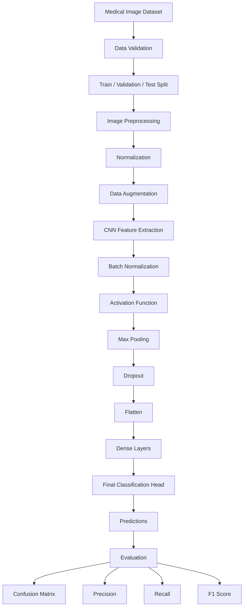

---

# 🧬 Machine Learning Pipeline

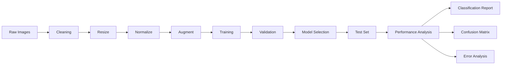

---

# 📂 Dataset Architecture

The dataset is dynamically loaded from a local directory or Google Drive environment.

### Dataset characteristics

| Property       | Description                                           |
| -------------- | ----------------------------------------------------- |
| Image format   | `.jpg`, `.jpeg`, `.png`                               |
| Task           | Binary / Multi-class classification                   |
| Input          | Medical images                                        |
| Training       | Model optimization                                    |
| Validation     | Hyperparameter and generalization monitoring          |
| Testing        | Final unbiased evaluation                             |
| Split strategy | Stratified partitioning                               |
| Preprocessing  | Resize + normalization                                |
| Augmentation   | Rotation, shear, flipping and related transformations |

Example structure:

```text
dataset/
│
├── train/
│   ├── class_0/
│   └── class_1/
│
├── validation/
│   ├── class_0/
│   └── class_1/
│
└── test/
    ├── class_0/
    └── class_1/
```

---

# 🔬 Data Processing Pipeline

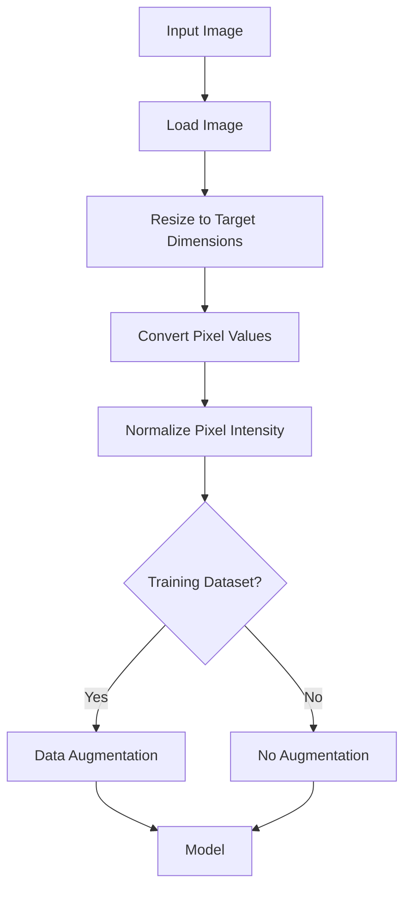

### Preprocessing objectives

The preprocessing stage standardizes the input space so that the CNN receives consistent tensors regardless of the original image dimensions.

Typical operations include:

```python
Image
  ↓
Resize
  ↓
Normalization
  ↓
Tensor Conversion
  ↓
CNN Input
```

---

# 🧠 CNN Architecture

The model follows a progressively hierarchical feature-learning strategy.

```text
INPUT
│
├── Conv2D
├── BatchNormalization
├── ReLU
├── MaxPooling2D
│
├── Conv2D
├── BatchNormalization
├── ReLU
├── MaxPooling2D
│
├── Dropout
│
├── Flatten
│
├── Dense
├── BatchNormalization
├── ReLU
│
├── Dropout
│
└── Output Layer
```

### Conceptual architecture


---

# 🧩 Layer Responsibilities

| Layer                | Purpose                                      |
| -------------------- | -------------------------------------------- |
| `Conv2D`             | Learns spatial features and local structures |
| `BatchNormalization` | Stabilizes intermediate activations          |
| `ReLU`               | Introduces non-linearity                     |
| `MaxPooling2D`       | Reduces spatial dimensions                   |
| `Dropout`            | Helps reduce overfitting                     |
| `Flatten`            | Converts feature maps into vectors           |
| `Dense`              | Performs high-level feature combination      |
| `Output Layer`       | Produces final classification probabilities  |

---

# ⚙️ Training Strategy

The training pipeline incorporates multiple mechanisms to improve generalization.

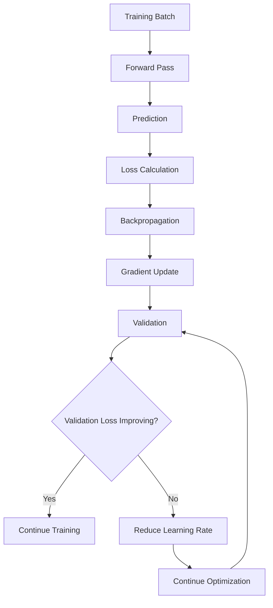

### Adaptive learning rate

`ReduceLROnPlateau` dynamically decreases the learning rate when validation performance stops improving.

This allows the model to:

* make larger updates during early training,
* perform finer optimization later,
* potentially escape training plateaus,
* improve convergence stability.

---

# 🛡️ Overfitting Control

Medical imaging datasets can be relatively small compared with general computer vision datasets.

This project therefore uses several regularization mechanisms:

```text
              Overfitting Risk
                    │
       ┌────────────┼────────────┐
       ▼            ▼            ▼
 Data Augmentation  Dropout   BatchNormalization
       │            │            │
       └────────────┼────────────┘
                    ▼
             Better Generalization
```

### Main techniques

**Data augmentation**

Creates additional training variation through transformations such as:

* rotation
* shear
* horizontal flipping
* vertical flipping
* spatial transformations

**Dropout**

Randomly disables a subset of neural connections during training.

**Batch normalization**

Normalizes intermediate activations and can make optimization more stable.

---

# 📊 Evaluation Framework

Accuracy alone is not sufficient for evaluating medical classification systems.

The evaluation pipeline therefore examines several complementary metrics.

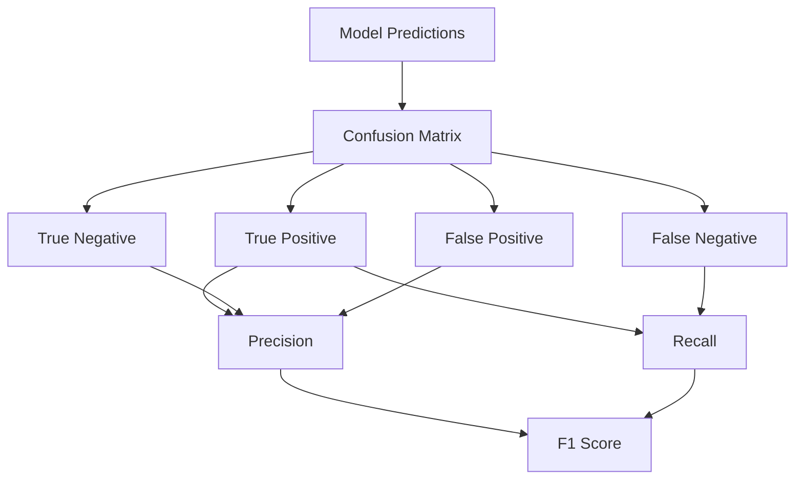

---

# 📐 Evaluation Mathematics

## Precision

Measures how many predicted positive cases were actually positive.

$$
Precision = \frac{TP}{TP + FP}
$$

---

## Recall / Sensitivity

Measures how many actual positive cases were successfully detected.

$$
Recall = \frac{TP}{TP + FN}
$$

---

## F1 Score

Balances precision and recall using their harmonic mean.

$$
F1 =
2
\times
\frac{Precision \times Recall}
{Precision + Recall}
$$

---

## Confusion Matrix

For binary classification:

```text
                    Actual
                ┌───────────────┐
                │ Positive │ Negative │
───────────────┼──────────┼───────────┤
Predicted      │          │          │
Positive       │    TP    │    FP    │
───────────────┼──────────┼───────────┤
Negative       │    FN    │    TN    │
───────────────┴──────────┴───────────┘
```

This allows detailed inspection of which classes the model confuses.

---

# 📈 Training Visualization

One of the most important diagnostics is the relationship between training and validation performance.

Recommended charts:

```text
Accuracy

1.0 ┤                 ╭────────────
    │             ╭───╯
0.8 ┤         ╭───╯
    │     ╭───╯
0.6 ┤ ╭───╯
    │╭╯
0.4 ┼──────────────────────────────
    └──────────────────────────────
       Epoch →


Loss

1.2 ┤╲
    │ ╲
0.8 ┤  ╲
    │   ╲
0.4 ┤    ╲____
    │
0.0 ┼──────────────────────────────
    └──────────────────────────────
       Epoch →
```

The actual experiment should generate:

* Training Accuracy vs Validation Accuracy
* Training Loss vs Validation Loss
* Learning-rate progression
* Confusion matrix
* Per-class precision/recall/F1

---

# 🖼️ Recommended Model Diagnostics

The project can be extended with a complete visual analysis dashboard:

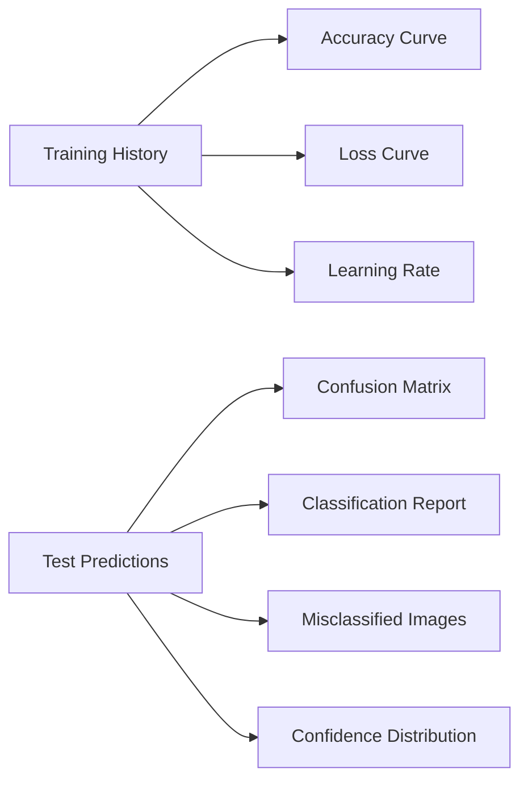

### Suggested visualizations

| Visualization          | Purpose                          |
| ---------------------- | -------------------------------- |
| Accuracy curve         | Detect convergence               |
| Loss curve             | Detect overfitting               |
| Confusion matrix       | Understand class-specific errors |
| Precision/Recall chart | Compare class performance        |
| F1 score chart         | Compare balanced performance     |
| Prediction confidence  | Understand model certainty       |
| Misclassified samples  | Perform visual error analysis    |
| Learning-rate curve    | Analyze optimization behavior    |

---

# 🔍 Error Analysis

A strong medical AI pipeline should not only ask:

> "How accurate is the model?"

It should also ask:

> "Where does the model fail?"

The error-analysis workflow can be represented as:

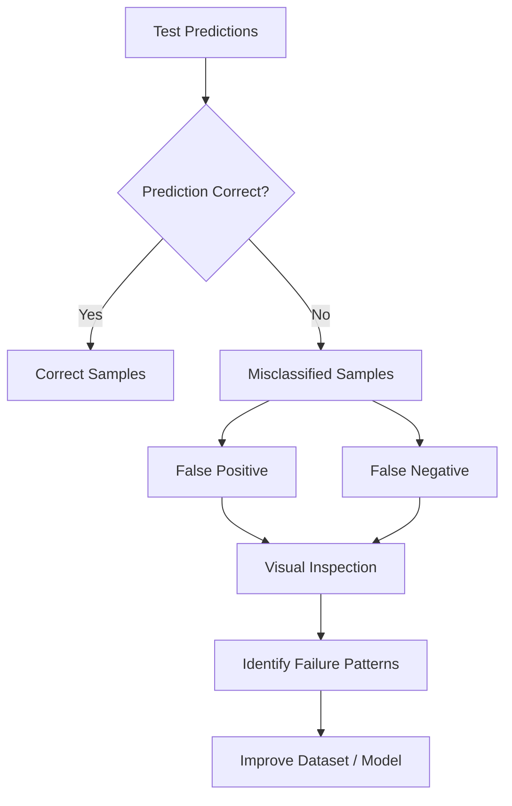

Potential sources of error include:

* insufficient training examples,
* class imbalance,
* noisy images,
* ambiguous pathology,
* inconsistent acquisition conditions,
* preprocessing artifacts,
* model overfitting.

---

# 📊 Suggested Performance Dashboard

A future experiment can present results using a dashboard such as:

```text
┌────────────────────────────────────────────────────┐
│                MODEL PERFORMANCE                   │
├───────────────┬───────────────┬────────────────────┤
│ Accuracy      │ Precision     │ Recall             │
│     XX.X%     │     XX.X%     │     XX.X%          │
├───────────────┼───────────────┼────────────────────┤
│ F1 Score      │ Test Samples  │ Classes            │
│     XX.X%     │     XXXX      │       X            │
└───────────────┴───────────────┴────────────────────┘
```

> Actual performance numbers should be inserted only after running the final experiment.

---

# 🛠️ Technology Stack

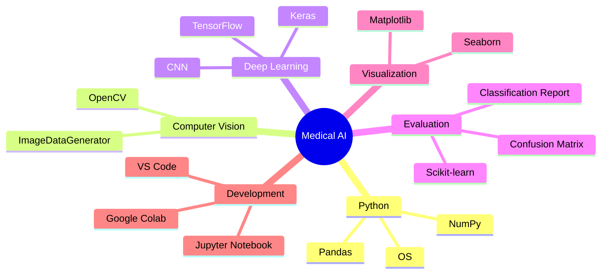

---

# 📦 Dependencies

### Core

* Python
* NumPy
* Pandas
* TensorFlow
* Keras
* OpenCV

### Machine Learning

* Scikit-learn

### Visualization

* Matplotlib
* Seaborn

Example installation:

```bash
pip install -r requirements.txt
```

---

# 🚀 Installation

## 1. Clone the repository

```bash
git clone https://github.com/argane1/Medical-Image-Classification-CNN-.git
cd Medical-Image-Classification-CNN-
```

---

## 2. Create a virtual environment

### Windows

```bash
python -m venv venv
venv\Scripts\activate
```

### Linux / macOS

```bash
python3 -m venv venv
source venv/bin/activate
```

---

## 3. Install dependencies

```bash
pip install -r requirements.txt
```

---

# ▶️ Running the Project

Open:

```text
scaner.ipynb
```

The notebook can be executed through:

* Visual Studio Code
* Jupyter Notebook
* Google Colab

For faster experimentation, Google Colab GPU acceleration can be enabled.

---

# 🧪 Experimental Workflow

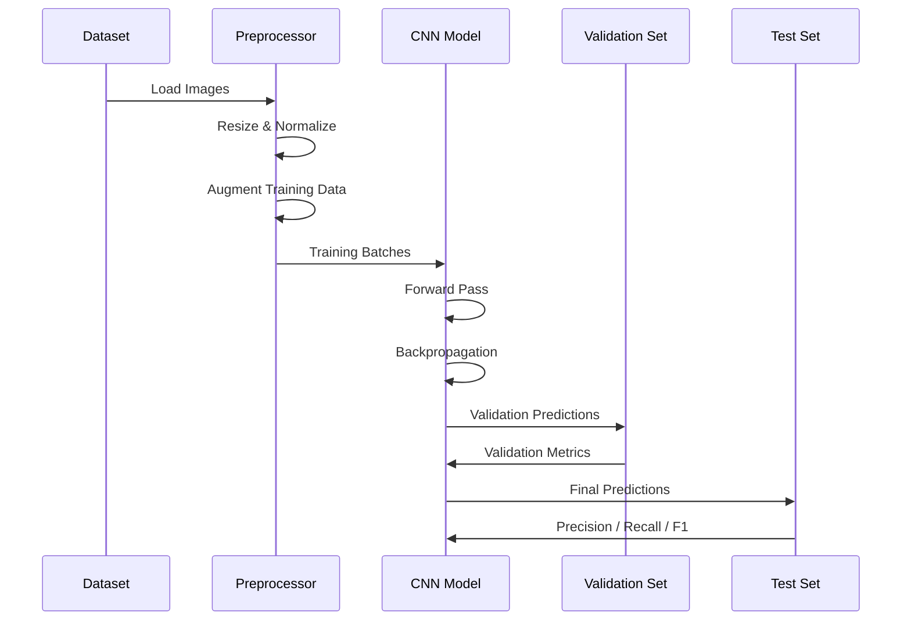

---

# 📁 Project Structure

```text
Medical-Image-Classification-CNN/
│
├── scaner.ipynb
├── requirements.txt
├── README.md
│
├── data/
│   ├── train/
│   ├── validation/
│   └── test/
│
├── models/
│   └── trained_model/
│
├── outputs/
│   ├── training_curves/
│   ├── confusion_matrix/
│   └── predictions/
│
└── results/
    ├── metrics.csv
    └── classification_report.txt
```

---

# 🧠 Why CNN?

Convolutional Neural Networks are particularly useful for image analysis because convolutional filters can learn hierarchical spatial patterns.

```text
Pixels
  │
  ▼
Edges
  │
  ▼
Textures
  │
  ▼
Shapes
  │
  ▼
Complex Structures
  │
  ▼
Clinical Classification
```

Early layers generally capture simple visual patterns, while deeper layers can learn increasingly complex representations.

---

# 🔬 Reproducibility

For reproducible experiments, future iterations should record:

```text
Dataset version
        ↓
Image dimensions
        ↓
Random seed
        ↓
Train / validation / test split
        ↓
Model architecture
        ↓
Hyperparameters
        ↓
Training duration
        ↓
Final metrics
```

Recommended experiment metadata:

| Parameter     | Example                           |
| ------------- | --------------------------------- |
| Image size    | 224 × 224                         |
| Batch size    | 32                                |
| Optimizer     | Adam                              |
| Learning rate | 0.001                             |
| Epochs        | 30                                |
| Loss          | Binary / Categorical Crossentropy |
| Random seed   | 42                                |

> Values above are examples and should be replaced with the actual experiment configuration.

---

# ⚠️ Limitations

This project currently has several important limitations.

### Dataset limitations

Performance depends strongly on:

* dataset quality,
* dataset size,
* class balance,
* image acquisition conditions,
* labeling quality.

### Generalization limitations

A CNN trained on one dataset may not generalize well to:

* different hospitals,
* different imaging devices,
* different patient populations,
* different acquisition protocols.

### Clinical limitations

This system is **not a clinical diagnostic tool**.

A model intended for real-world deployment would require substantially more validation, including external datasets, robustness testing, calibration, explainability, and appropriate clinical/regulatory review.

---

# 🔮 Future Improvements

The project can evolve into a considerably more advanced medical AI system.

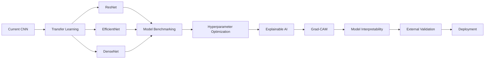

### Planned extensions

* Transfer learning with ResNet / EfficientNet / DenseNet
* Hyperparameter optimization
* Class-weighted training
* Cross-validation
* ROC-AUC and PR-AUC
* Grad-CAM visual explanations
* Model calibration
* External validation datasets
* Experiment tracking
* REST API deployment
* Docker containerization
* Cloud inference

---

# 🌐 Potential Production Architecture

A future production implementation could follow:

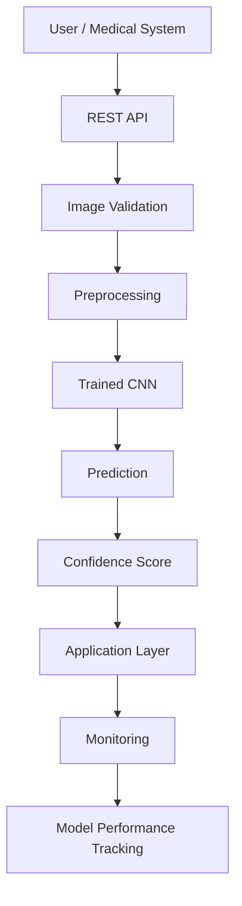

This separates:

```text
Frontend
   ↓
API
   ↓
Preprocessing
   ↓
ML Model
   ↓
Prediction
   ↓
Monitoring
```

making future deployment significantly easier.

---

# 📚 Evaluation Philosophy

A strong medical AI model should not be evaluated using a single number.

The goal is to understand:

```text
                MODEL QUALITY
                      │
        ┌─────────────┼─────────────┐
        ▼             ▼             ▼
     Accuracy      Recall       Precision
        │             │             │
        └─────────────┼─────────────┘
                      ▼
                  F1 Score
                      │
                      ▼
               Error Analysis
                      │
                      ▼
              Generalization
```

The ultimate objective is therefore **reliable generalization**, not simply maximizing training accuracy.

---

# 👨‍💻 Author

**Rachid Argane**

AI / Machine Learning Engineer
Deep Learning • Computer Vision • AI Systems

GitHub:

[https://github.com/argane1](https://github.com/argane1)

---

# ⭐ Project Status

```text
🟢 Core CNN Pipeline        Implemented
🟢 Image Preprocessing      Implemented
🟢 Data Augmentation        Implemented
🟢 Model Training           Implemented
🟢 Evaluation               Implemented
🟡 Advanced Explainability  Planned
🟡 Transfer Learning        Planned
🟡 Production API           Planned
```

---

# 📜 Disclaimer

This repository is intended for **educational and research purposes only**.

The model outputs should not be used as a substitute for professional medical diagnosis, clinical judgment, or patient care.

---

<p align="center">

### ⭐ If you find this project useful, consider starring the repository.

</p>
```

